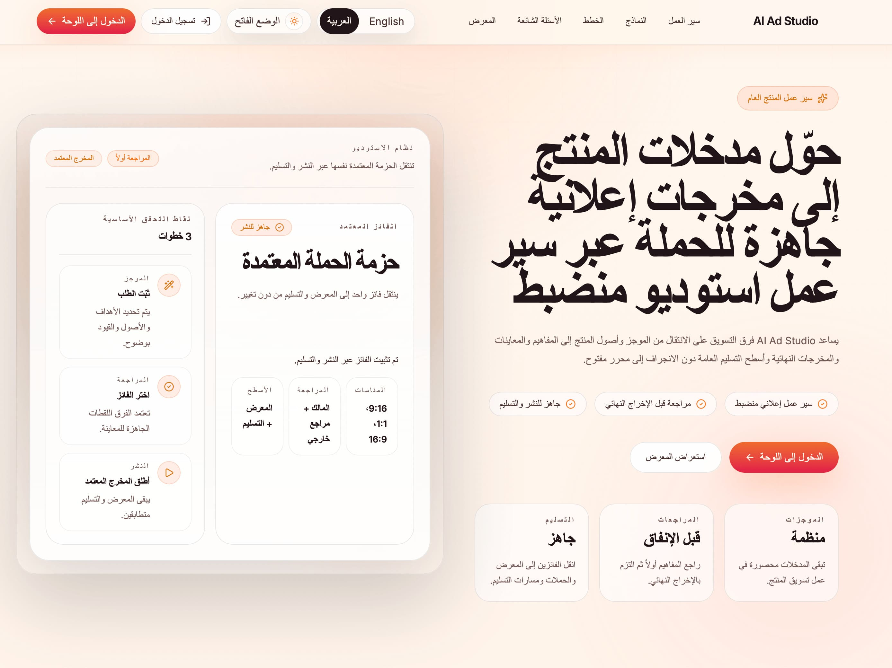

# AI Ad Studio

<p>
  <strong>Languages:</strong>
  <code>English</code>
  <code>العربية</code>
</p>

<p>
  <a href="https://runwayml.com/">
    
  </a>
</p>

AI Ad Studio is a premium, constrained ad-generation system for product marketing teams, ecommerce brands, app founders, and agencies.

Instead of trying to be a general video editor, this repository focuses on one narrow, high-quality workflow:

**brief → concepts → previews → controlled render batches → review → canonical winner → promotion → delivery**

That constraint is the product advantage. AI handles concepting, copy, and render planning, while the application enforces quality through templates, validations, approvals, review gates, and production-safe workflows.

## Media providers

The repo now supports three runtime modes for preview and scene-video generation:

- `Runway only`: use Runway for both previews and scene video
- `Hybrid`: use Runway for previews and a local inference sidecar for scene video
- `Fully local`: use the local inference sidecar for both previews and scene video

Runway is now an optional provider rather than a global requirement. If either `PREVIEW_PROVIDER` or `SCENE_VIDEO_PROVIDER` is set to `runway`, you still need an active paid [Runway](https://runwayml.com/) API subscription and a valid `RUNWAYML_API_SECRET`.

The current local-model matrix is:

- scene video baseline: `cogvideox1.5-5b-i2v`
- scene video high-end: `wan2.1-i2v-14b-480p`
- scene video fallback: `svd-img2vid`
- preview image default: `flux-schnell`
- preview image lighter fallback: `sdxl-turbo`

## Screenshots


     


## What this repository includes

- structured product brief capture
- brand kits and reusable templates
- concept generation and storyboard preview flow
- controlled multi-variant render batches
- side-by-side batch review and winner selection
- external reviewer links with comments and approval state
- final decision locking with canonical export selection
- winner-only public promotion workflow
- public campaign pages
- finalized client delivery workspace
- owner-controlled single-export share links

## Product scope

AI Ad Studio is designed for short-form product advertising.

Current repository direction:

- product ad concepts only
- controlled variants instead of open-ended generation
- short exports and platform-aware render presets
- approval and review as first-class workflow steps
- public promotion only after final decision
- delivery workspace only from finalized canonical exports

## Public surfaces and intended usage

The repository currently has three public token-based surfaces. They are not interchangeable.

### 1. Campaign pages

Campaign pages are the primary public promotion surface.

Use them when:

- a reviewed export has been finalized
- the export is the current canonical winner for the project
- the goal is public-facing promotion or showcase-style sharing

Rules:

- winner-only
- canonical-only
- promotion-oriented

### 2. Delivery pages

Delivery pages are the primary client handoff surface.

Use them when:

- a reviewed export has been finalized
- the export is the current canonical winner for the project
- the goal is structured delivery with handoff notes, approval summary, and downloadable assets

Rules:

- canonical-only
- handoff-oriented
- supports included exports from the finalized batch, but anchored to the canonical export

### 3. Share links

Share links are a lighter owner-controlled utility surface for a single export.

Use them when:

- you want to quickly share one export for preview or internal distribution outside the main winner-only flow
- you do not need campaign messaging
- you do not need delivery workspace structure or approval summary

Rules:

- single-export utility
- owner-created
- separate from winner-only campaign and canonical delivery workflows

## Current capabilities

The current repo state supports:

- brief capture, concept generation, and preview flow
- controlled render batch generation
- internal and external review collection
- winner selection and final decision locking
- current-canonical promotion gating
- public campaign pages for canonical winners
- public delivery workspaces for canonical winners
- token-scoped single-export share links
- worker polling, job claiming, and provider-backed generation flow
- token-scoped public media delivery with authenticated owner dashboard downloads

## Monorepo layout

- `apps/web` — Next.js application for product workflow, review, publishing, and delivery
- `apps/worker` — async orchestration and job execution
- `packages/shared` — shared contracts and types
- `packages/config` — runtime configuration utilities
- `packages/ui` — reusable UI primitives
- `packages/providers` — provider contracts and adapters
- `packages/media` — media pipeline utilities

## Core workflow

1. Create a project and upload product assets
2. Generate controlled concepts
3. Generate previews
4. Render controlled A/B variation batches
5. Review outputs internally and externally
6. Select a winner
7. Finalize the canonical export
8. Promote the finalized winner to showcase or campaign
9. Prepare a client delivery workspace

## Architecture

The system follows a thin web layer plus durable database plus async worker model.

- the web app owns product UX, state transitions, approvals, and public pages
- the worker owns slow orchestration, provider calls, and render/composition tasks
- storage and metadata stay durable so long-running jobs can be resumed, audited, and reviewed
- render batches, external review, promotion, and delivery all build on explicit persisted records rather than transient client state

## Local development

### Prerequisites

- Node.js 22 or newer
- pnpm 10
- a configured Supabase project
- R2 credentials for asset upload and public media delivery
- OpenAI credentials for text and speech generation flows
- Python 3.11 or newer if you want the local inference sidecar
- an active paid [Runway](https://runwayml.com/) API subscription only if you select `runway` for previews or scene video

### Install

Run `pnpm install`.

### Environment setup

Create a local env file from the example with `cp .env.example .env.local`.

Fill in the values in `.env.local`.

### Environment matrix

#### Web minimum

These values are required for the authenticated web app and Supabase-backed session handling:

- `NEXT_PUBLIC_APP_NAME`
- `NEXT_PUBLIC_APP_URL`
- `NEXT_PUBLIC_SUPABASE_URL`
- `NEXT_PUBLIC_SUPABASE_ANON_KEY`

#### Web full workflow

These additional server-side values are required for the full product workflow, including token-backed public pages, share links, uploads, downloads, and storage access:

- `SUPABASE_SERVICE_ROLE_KEY`
- `R2_ACCOUNT_ID`
- `R2_ACCESS_KEY_ID`
- `R2_SECRET_ACCESS_KEY`
- `R2_BUCKET_NAME`

#### Worker required

The worker reads directly from `process.env` and requires these values to claim and execute jobs:

- `NEXT_PUBLIC_SUPABASE_URL`
- `SUPABASE_SERVICE_ROLE_KEY`
- `WORKER_POLL_INTERVAL_MS`
- `R2_ACCOUNT_ID`
- `R2_ACCESS_KEY_ID`
- `R2_SECRET_ACCESS_KEY`
- `R2_BUCKET_NAME`
- `OPENAI_API_KEY`

#### Worker defaults

These values are optional because the worker code provides defaults:

- `OPENAI_CONCEPT_MODEL` defaults to `gpt-4o-mini`
- `OPENAI_TTS_MODEL` defaults to `gpt-4o-mini-tts`
- `OPENAI_TTS_VOICE` defaults to `alloy`
- `PREVIEW_PROVIDER` defaults to `runway`
- `SCENE_VIDEO_PROVIDER` defaults to `runway`
- `RUNWAY_IMAGE_MODEL` defaults to `gen4_image_turbo`
- `RUNWAY_VIDEO_MODEL` defaults to `gen4_turbo`
- `LOCAL_INFERENCE_BASE_URL` defaults to `http://127.0.0.1:8788`
- `LOCAL_IMAGE_MODEL` defaults to `flux-schnell`
- `LOCAL_VIDEO_MODEL` defaults to `cogvideox1.5-5b-i2v`
- `LOCAL_DEVICE` defaults to `cuda`
- `LOCAL_DTYPE` defaults to `bf16`
- `LOCAL_ENABLE_CPU_OFFLOAD` defaults to `false`
- `LOCAL_INFERENCE_TIMEOUT_MS` defaults to `900000`

### Provider selector env vars

The worker chooses preview and scene-video generation independently:

- `PREVIEW_PROVIDER=runway|local_http|mock`
- `SCENE_VIDEO_PROVIDER=runway|local_http`

Conditional requirements:

- `RUNWAYML_API_SECRET` is required only if either provider is `runway`
- `LOCAL_INFERENCE_BASE_URL` is required only if either provider is `local_http`
- `LOCAL_IMAGE_MODEL` matters only when `PREVIEW_PROVIDER=local_http`
- `LOCAL_VIDEO_MODEL` matters only when `SCENE_VIDEO_PROVIDER=local_http`

### Which local model should I use?

| Hardware tier | Preview recommendation                     | Scene video recommendation | Notes                                            |
| ------------- | ------------------------------------------ | -------------------------- | ------------------------------------------------ |
| 12–16GB GPU   | `sdxl-turbo` if needed                     | `cogvideox1.5-5b-i2v`      | Best starting point for mixed-tier machines      |
| 24GB+ GPU     | `flux-schnell`                             | `wan2.1-i2v-14b-480p`      | Higher quality, heavier VRAM and runtime cost    |
| CPU / macOS   | `mock` or `flux-schnell` only if practical | not recommended            | Treat local video as unsupported or experimental |

### Local inference sidecar setup

The local sidecar lives in `services/local-inference` and exposes:

- `GET /health`
- `POST /v1/preview`
- `POST /v1/scene-video`
- `GET /v1/artifacts/{artifactId}`

Setup:

```bash
cd services/local-inference
python3 -m venv .venv
source .venv/bin/activate
pip install -r requirements.txt
```

Start the sidecar from the repo root:

```bash
pnpm dev:local-inference
```

Or directly:

```bash
python3 -m uvicorn app.main:app --app-dir services/local-inference --host 127.0.0.1 --port 8788 --reload
```

### Sample env blocks

Runway only:

```bash
PREVIEW_PROVIDER=runway
SCENE_VIDEO_PROVIDER=runway
RUNWAYML_API_SECRET=your-runway-key
RUNWAY_IMAGE_MODEL=gen4_image_turbo
RUNWAY_VIDEO_MODEL=gen4_turbo
```

Hybrid:

```bash
PREVIEW_PROVIDER=runway
SCENE_VIDEO_PROVIDER=local_http
RUNWAYML_API_SECRET=your-runway-key
LOCAL_INFERENCE_BASE_URL=http://127.0.0.1:8788
LOCAL_VIDEO_MODEL=cogvideox1.5-5b-i2v
LOCAL_DEVICE=cuda
LOCAL_DTYPE=bf16
```

Fully local:

```bash
PREVIEW_PROVIDER=local_http
SCENE_VIDEO_PROVIDER=local_http
LOCAL_INFERENCE_BASE_URL=http://127.0.0.1:8788
LOCAL_IMAGE_MODEL=flux-schnell
LOCAL_VIDEO_MODEL=cogvideox1.5-5b-i2v
LOCAL_DEVICE=cuda
LOCAL_DTYPE=bf16
LOCAL_ENABLE_CPU_OFFLOAD=false
```

Preview-only local / lightweight dev:

```bash
PREVIEW_PROVIDER=mock
SCENE_VIDEO_PROVIDER=local_http
LOCAL_INFERENCE_BASE_URL=http://127.0.0.1:8788
LOCAL_VIDEO_MODEL=cogvideox1.5-5b-i2v
```

### Important startup note

Next.js will load `.env.local` automatically for the web app.

The worker does not use a dotenv loader in its current script. It reads from the shell environment. Before starting the worker, export the env values into the shell session that will run it.

One simple local workflow is:

    set -a
    source .env.local
    set +a

After that, start the apps in separate terminals.

### Start the web app

Run `pnpm dev:web`.

### Start the worker

Run `pnpm dev:worker`.

### Start the local inference sidecar

Run `pnpm dev:local-inference`.

### Start both from the repo root

This works only after the worker-required env variables are already exported into the shell:

Run `pnpm dev`.

### Run checks

Run:

    pnpm lint
    pnpm test
    pnpm build
    pnpm typecheck

Or run the full Phase 31 verification wrapper:

    pnpm verify:phase-31

Do not run `pnpm typecheck` and `pnpm build` in parallel for this repo. Both commands touch `.next`, and parallel execution can produce false-negative Next type generation errors.

### Runtime smoke

For deployed runtime validation, run:

    SMOKE_BASE_URL=https://your-app.example.com pnpm smoke:runtime

To run local verification plus optional deployed smoke checks in one pass:

    SMOKE_BASE_URL=https://your-app.example.com pnpm verify:phase-31

Optional smoke inputs:

- `SMOKE_SHARE_TOKEN`
- `SMOKE_CAMPAIGN_TOKEN`
- `SMOKE_DELIVERY_TOKEN`
- `SMOKE_DELIVERY_EXPORT_ID`
- `SMOKE_REVIEW_TOKEN`
- `SMOKE_CHECK_SHARE_DOWNLOAD=true`
- `SMOKE_CHECK_CAMPAIGN_DOWNLOAD=true`
- `SMOKE_ALLOW_DEGRADED_HEALTH=true`
- `SMOKE_REQUEST_TIMEOUT_MS=15000`

`/api/health` exposes operator-safe readiness booleans for public app URL, Supabase auth, service-role availability, and R2 storage configuration. The smoke script uses that payload to fail early when requested token-surface checks depend on missing runtime configuration.

The smoke command checks `/api/health` plus any configured public token surfaces and download routes.

To inspect the deployment health payload directly:

    curl -sS https://your-app.example.com/api/health

The expected healthy shape is:

```json
{
  "name": "AI Ad Studio",
  "service": "web",
  "status": "ok",
  "readiness": {
    "publicAppUrlConfigured": true,
    "supabaseAuthConfigured": true,
    "serviceRoleConfigured": true,
    "r2Configured": true
  }
}
```

If `status` is `degraded`, use the readiness flags to fix the missing runtime dependency before validating public routes:

- `publicAppUrlConfigured: false` means `NEXT_PUBLIC_APP_URL` is missing or empty
- `supabaseAuthConfigured: false` means `NEXT_PUBLIC_SUPABASE_URL` or `NEXT_PUBLIC_SUPABASE_ANON_KEY` is missing
- `serviceRoleConfigured: false` means `SUPABASE_SERVICE_ROLE_KEY` is missing
- `r2Configured: false` means one or more of `R2_ACCOUNT_ID`, `R2_ACCESS_KEY_ID`, `R2_SECRET_ACCESS_KEY`, or `R2_BUCKET_NAME` is missing

Do not treat share, campaign, or delivery downloads as production-ready while `r2Configured` is `false`.

### Build and start individually

Web:

    pnpm --filter @ai-ad-studio/web build
    pnpm --filter @ai-ad-studio/web start

Worker:

    pnpm --filter @ai-ad-studio/worker build
    pnpm --filter @ai-ad-studio/worker start

## Runtime notes

- if the public Supabase keys are missing, authenticated web flows and login-dependent pages will not work
- if the R2 variables are missing, upload and download routes will return storage configuration errors
- if the worker-required variables are missing, the worker stays alive and keeps polling for configuration instead of processing jobs
- if a selected provider is `runway` and `RUNWAYML_API_SECRET` is missing, the worker will refuse to start that configuration
- if a selected provider is `local_http` and the sidecar is unreachable, preview or scene-video jobs will fail with a local inference connectivity error
- if the local model is too large for the available VRAM, the sidecar will fail during model load or inference; switch to a lighter model or enable CPU offload
- public campaign, share, and delivery media routes rely on token-scoped access plus server-side R2 reads
- owner dashboard export downloads remain authenticated
- `/api/health` now exposes operator-safe readiness booleans for auth, service-role access, R2, and public app URL configuration
- local video support only changes scene generation; FFmpeg composition remains the final export compositor

## Known limitations

Current known limitations and truths:

- the worker still expects its required environment variables to be present in the shell environment that launches it
- token-backed public routes are runtime-safe by design, but they should still be smoke-validated in each deployment environment
- repo smoke coverage is focused on critical business rules and state derivation, not full browser end-to-end automation
- migration application and infrastructure provisioning are assumed to happen outside this repo
- delivery analytics and client acknowledgement flows are not part of Phase 31 and are better handled in Phase 32

## Deployment assumptions

- the web runtime needs the public Supabase keys in every environment
- the server-side web runtime also needs `SUPABASE_SERVICE_ROLE_KEY` and the R2 credentials for share links, public token routes, and asset delivery
- the worker runtime needs Supabase service-role access, R2 credentials, OpenAI credentials, plus whichever media-provider credentials/endpoints match the selected env providers
- promotion, review, delivery, and public token pages assume the database schema and migrations are already applied before the services are started

## Deployment troubleshooting

- if `pnpm smoke:runtime` fails because `/api/health` is `degraded`, fix the missing env vars first instead of debugging public routes
- if `r2Configured` is `false`, expect token-backed downloads and storage-backed media delivery to fail even when the pages themselves render
- if you only need a temporary diagnostic pass while infrastructure is being wired, rerun with `SMOKE_ALLOW_DEGRADED_HEALTH=true`, but do not treat that as release-ready

## Release-candidate validation checklist

Before treating the repo as release-candidate ready, verify all of the following:

- `pnpm lint`
- `pnpm test`
- `pnpm build`
- `pnpm typecheck`

And, when validating a real deployed environment:

- `SMOKE_BASE_URL=https://your-app.example.com pnpm smoke:runtime`

And manually verify:

- an active `/review/[token]` page is writable
- a finalized or inactive `/review/[token]` page is frozen
- `/campaign/[token]` plays media without login
- `/delivery/[token]` downloads included assets without login
- `/share/[token]` still works as a single-export share surface
- `/api/exports/[exportId]/download` remains protected when logged out

## Development standards

This repository prefers:

- production-grade changes over quick hacks
- small focused modules instead of oversized files
- strong typing and explicit validation
- clean architectural boundaries
- durable workflow records for anything reviewable or long-running
- descriptive commit messages and cohesive pull requests

## Contribution flow

Read these files before contributing:

- `CONTRIBUTING.md`
- `CODE_OF_CONDUCT.md`
- `SECURITY.md`
- `SUPPORT.md`

## Security

Please do not report vulnerabilities in public issues. See `SECURITY.md`.

## License

This repository is licensed under the MIT License. See `LICENSE`.
