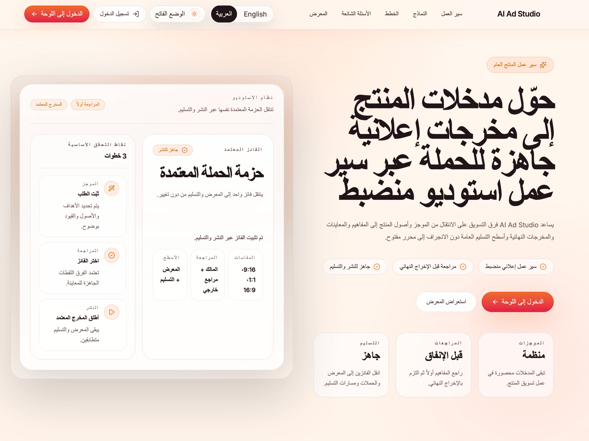
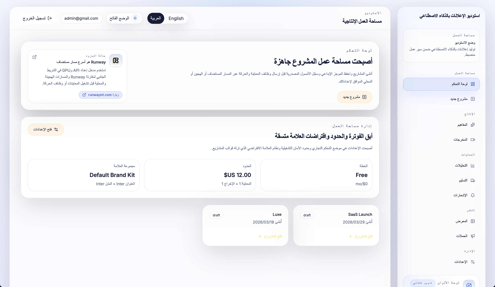
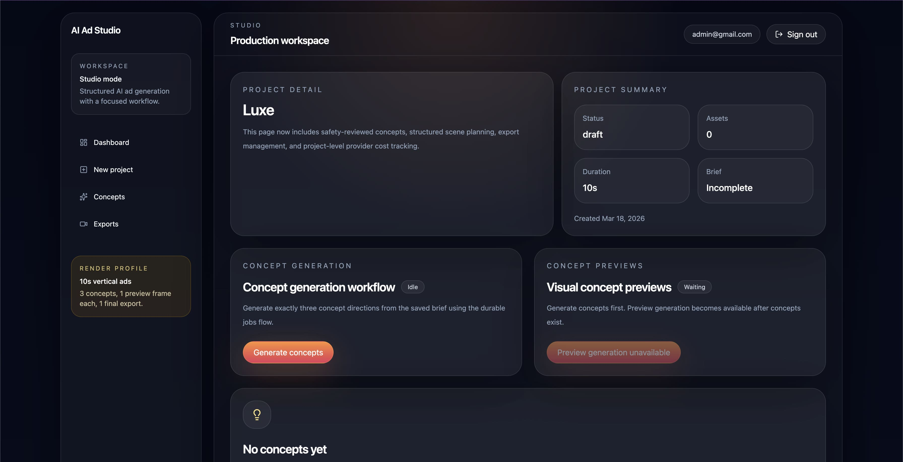
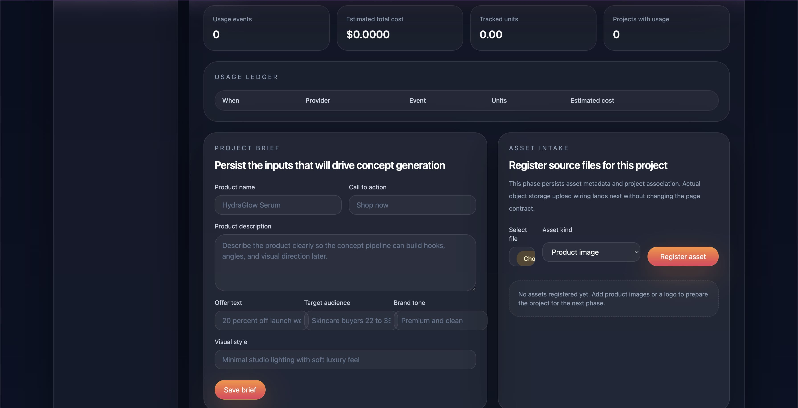
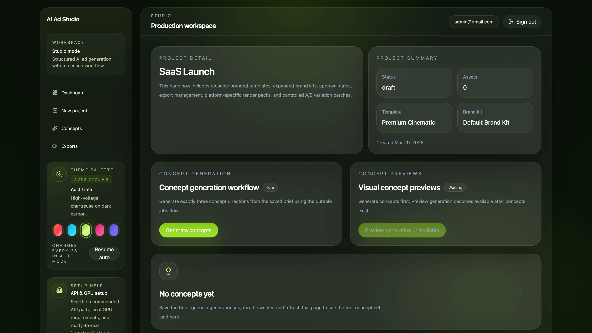
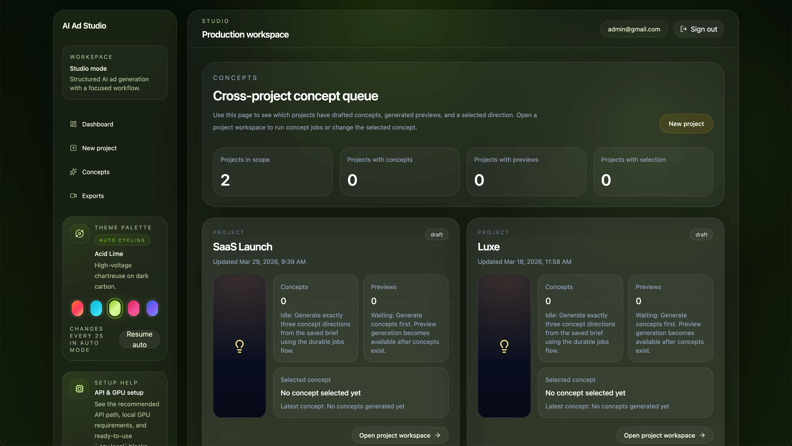
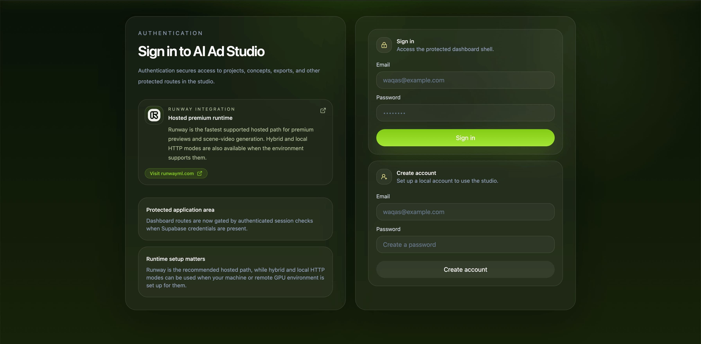

# AI Ad Studio — Production SaaS Starter Kit

<p>
  <strong>Reference app languages:</strong>
  <code>English</code>
  <code>العربية</code>
</p>

AI Ad Studio is a production-oriented SaaS starter kit for teams building AI-powered creative products. It combines a complete ad-production reference application with the reusable infrastructure needed to launch, operate, and extend a modern AI SaaS.

Fork it to build your own product, replace the ad-specific workflow with another durable AI workflow, or use the included application as the foundation for an ad creative platform.

The reference implementation follows one explicit path:

**brief → concepts → previews → controlled render batches → review → canonical winner → promotion → delivery**

[View the reference deployment](https://ai-ad-studio-web.vercel.app)

## What this starter is

- A working, opinionated SaaS application rather than an empty framework scaffold.
- A reference for durable AI workflows with persisted checkpoints, async jobs, approvals, retries, and auditable state.
- A monorepo with a Next.js web application, Node worker, shared packages, Supabase migrations, and an optional local inference service.
- A foundation for authentication, owner-scoped workspaces, subscription billing, entitlements, usage controls, storage, localization, public sharing, and operational diagnostics.
- A provider-adapter architecture that can use hosted AI services, local inference, or test doubles without rewriting the product workflow.
- A production-minded baseline with linting, unit and component tests, browser automation, build checks, runtime health checks, and deployment smoke scripts.

## What this starter is not

- It is not a hosted service or a one-click deployment. You provision and operate Supabase, object storage, billing, and AI providers.
- It is not a vendor-neutral blank slate. AI Ad Studio is a complete reference vertical, so adapting another domain means replacing its workflow language and business rules deliberately.
- It is not a no-code product builder or general-purpose video editor.
- It does not include provider credits, GPU capacity, cloud resources, secrets, or production data.
- It does not make a deployment production-ready by itself. You remain responsible for security review, backups, observability, legal requirements, provider limits, and environment-specific validation.
- It is not an unconstrained generation playground. The included product favors controlled variants, review gates, canonical outputs, and traceable decisions.

## Included reference product

AI Ad Studio demonstrates the starter through a short-form product advertising workflow:

- structured product briefs, brand kits, and reusable templates
- AI-assisted concepts, copy, storyboards, and previews
- controlled multi-variant render batches
- side-by-side review, comments, approval state, and winner selection
- canonical export finalization and winner-only promotion
- public campaign pages and token-scoped share links
- client delivery workspaces anchored to finalized exports
- activation packages and creative-performance ingestion
- deterministic creative-performance insights tied to creative lineage
- owner subscriptions, plan entitlements, usage rollups, and free-plan watermarking
- background job polling, provider execution, job traces, and delivery reminder sweeps

## Screenshots









## Make it your own

The codebase keeps customization points separated so you can change one layer without flattening the architecture.

### Brand and product language

- Set the deployed application name and URL through `NEXT_PUBLIC_APP_NAME` and `NEXT_PUBLIC_APP_URL`.
- Replace the English and Arabic catalogs under `apps/web/src/lib/i18n/messages`.
- Update the application icon, marketing components, email/public-surface copy, and plan display names.
- Keep visible UI copy inside the typed i18n layer so both locales and LTR/RTL layouts stay valid.

### Domain workflow

- Replace ad-specific feature modules under `apps/web/src/features`.
- Keep authenticated mutations in server actions and durable data access under `apps/web/src/server`.
- Model important workflow transitions in Supabase instead of long-lived browser state.
- Add or replace job handlers under `apps/worker/src/jobs/handlers` for slow or retryable work.

### AI and media providers

- Implement provider contracts in `packages/providers` and connect them through worker factories.
- Use the existing Runway, local HTTP, and mock preview paths as integration examples.
- Extend `packages/media` when output composition or media processing changes.

### Infrastructure and commercial model

- Replace Supabase, R2, or Stripe behind their server-side boundaries if your stack differs.
- Change seeded billing plans, entitlements, operator ceilings, and usage policies together so enforcement remains consistent in the web app and worker.
- Add migrations before changing TypeScript database contracts.

### Public experiences

- Adapt campaign pages for promotion, delivery workspaces for structured handoff, and share links for lightweight distribution.
- Preserve token scoping and canonical-output rules unless your replacement workflow defines a different trust model.

## Architecture

The starter uses a thin web layer, a durable database, and an asynchronous worker.

- **Web:** Next.js 16 App Router and React 19 own product UX, authentication, server actions, state transitions, billing, and public pages.
- **Database and auth:** Supabase is the durable system of record for users, workflow state, jobs, approvals, notifications, billing, and analytics.
- **Worker:** A Node/TypeScript process polls and claims jobs, calls providers, performs render orchestration, and runs reminder sweeps.
- **Storage:** Cloudflare R2 stores uploaded and generated media; database records keep lineage and access metadata.
- **Providers:** OpenAI supports text and speech flows. Preview and scene-video generation can use Runway or the local HTTP sidecar.
- **Composition:** FFmpeg remains the final export compositor.
- **Billing:** Stripe-backed subscriptions are reconciled into schema-backed plans, limits, usage, and audit records.
- **Localization:** Typed English and Arabic catalogs support persisted locale choice and document-level LTR/RTL switching.

Important state is persisted so long-running work can resume, fail visibly, and remain reviewable. Public surfaces are intentionally separated by purpose rather than implemented as alternate skins over one route.

## Monorepo layout

```text
apps/web/                  Next.js product, dashboard, billing, and public surfaces
apps/worker/               Async job execution and scheduled operational work
packages/config/           Runtime configuration utilities
packages/media/            Media pipeline and composition helpers
packages/providers/        AI provider contracts and adapters
packages/shared/           Shared contracts and types
packages/ui/               Reusable UI primitives
services/local-inference/  Optional Python HTTP inference sidecar
supabase/migrations/       Versioned database changes
scripts/checks/            Local, deployment, and release verification
```

## Public surfaces in the reference app

The three token-backed public experiences serve different trust and product goals:

1. **Campaign pages** promote the current finalized canonical winner.
2. **Delivery pages** provide structured client handoff anchored to the canonical export, with related finalized batch exports when included.
3. **Share links** expose one owner-selected export for lightweight preview or distribution.

Campaign and delivery pages are winner/canonical-only. Share links remain a separate, owner-controlled single-export utility.

## Getting started

### Prerequisites

- Node.js 22 or newer
- pnpm 10
- a configured Supabase project
- Cloudflare R2 credentials for uploads and media delivery
- OpenAI credentials for text and speech generation
- Python 3.11 or newer when using the local inference sidecar
- a paid Runway account and `RUNWAYML_API_SECRET` only when a selected media provider is `runway`
- FFmpeg for final media composition

### Install

```bash
pnpm install
cp .env.example .env.local
```

Fill in `.env.local`, then apply the migrations in `supabase/migrations` to your Supabase project using your normal Supabase deployment workflow.

The example environment file covers the primary web, worker, storage, OpenAI, Runway, and local-inference settings. Billing and operator features additionally use the optional Stripe and operator variables defined in `apps/web/src/lib/env.ts`.

### Minimum web configuration

The authenticated web app needs:

```text
NEXT_PUBLIC_APP_NAME
NEXT_PUBLIC_APP_URL
NEXT_PUBLIC_SUPABASE_URL
NEXT_PUBLIC_SUPABASE_ANON_KEY
```

The full server-backed workflow also needs:

```text
SUPABASE_SERVICE_ROLE_KEY
R2_ACCOUNT_ID
R2_ACCESS_KEY_ID
R2_SECRET_ACCESS_KEY
R2_BUCKET_NAME
```

### Worker configuration

The worker needs Supabase service-role access, R2 credentials, `OPENAI_API_KEY`, and the credentials or endpoint required by the selected media providers.

The worker reads directly from `process.env`; it does not load `.env.local` itself. Export the values in the shell that starts the worker:

```bash
set -a
source .env.local
set +a
pnpm dev:worker
```

## Media provider modes

Preview and scene-video generation are selected independently:

```text
PREVIEW_PROVIDER=runway|local_http|mock
SCENE_VIDEO_PROVIDER=runway|local_http
```

Supported combinations include:

- **Runway only:** Runway generates previews and scene video.
- **Hybrid:** Runway generates previews while the local sidecar generates scene video.
- **Fully local:** The local sidecar generates previews and scene video.
- **Lightweight development:** Mock previews avoid image-provider calls while another configured provider handles scene video.

Conditional requirements:

- `RUNWAYML_API_SECRET` is required when either provider is `runway`.
- `LOCAL_INFERENCE_BASE_URL` is required when either provider is `local_http`.
- `LOCAL_IMAGE_MODEL` applies to local previews.
- `LOCAL_VIDEO_MODEL` applies to local scene generation.

Current local defaults:

| Purpose          | Default               | Alternatives                                                             |
| ---------------- | --------------------- | ------------------------------------------------------------------------ |
| Preview image    | `flux-schnell`        | `sdxl-turbo` for a lighter path                                          |
| Scene video      | `cogvideox1.5-5b-i2v` | `wan2.1-i2v-14b-480p` for high-end hardware; `svd-img2vid` as a fallback |
| Device and dtype | `cuda` / `bf16`       | Configure to match the inference host                                    |

Local video generation is GPU-intensive. CPU-only and many macOS environments should use mock previews or a hosted provider for practical development.

### Local inference sidecar

The sidecar exposes `GET /health`, `POST /v1/preview`, `POST /v1/scene-video`, and `GET /v1/artifacts/{artifactId}`.

```bash
cd services/local-inference
python3 -m venv .venv
source .venv/bin/activate
pip install -r requirements.txt
cd ../..
pnpm dev:local-inference
```

The default base URL is `http://127.0.0.1:8788`.

## Run locally

Start each process in its own terminal:

```bash
pnpm dev:web
pnpm dev:worker
pnpm dev:local-inference # only when using local_http
```

`pnpm dev` starts the workspace applications together, but the worker-required values must already be exported into that shell.

Build and start one application directly when needed:

```bash
pnpm --filter @ai-ad-studio/web build
pnpm --filter @ai-ad-studio/web start

pnpm --filter @ai-ad-studio/worker build
pnpm --filter @ai-ad-studio/worker start
```

## Verification

Run the standard repository checks:

```bash
pnpm lint
pnpm test
pnpm build
pnpm typecheck
```

Do not run `pnpm build` and `pnpm typecheck` in parallel. Both touch `.next`, and concurrent execution can produce false-negative Next.js type-generation errors.

The supported sequential wrapper is:

```bash
pnpm verify:phase-31
```

Browser tests use deterministic Supabase-backed fixtures and require a reachable test project with service-role access:

```bash
pnpm --filter @ai-ad-studio/web test:e2e:setup
pnpm --filter @ai-ad-studio/web test:e2e:smoke
```

## Deployment validation

Apply migrations before starting production services, configure every runtime separately, and verify the deployed health endpoint:

```bash
curl -sS https://your-app.example.com/api/health
SMOKE_BASE_URL=https://your-app.example.com pnpm smoke:runtime
```

Optional token inputs extend the smoke test across public routes:

- `SMOKE_SHARE_TOKEN`
- `SMOKE_CAMPAIGN_TOKEN`
- `SMOKE_DELIVERY_TOKEN`
- `SMOKE_DELIVERY_EXPORT_ID`
- `SMOKE_REVIEW_TOKEN`
- `SMOKE_CHECK_SHARE_DOWNLOAD=true`
- `SMOKE_CHECK_CAMPAIGN_DOWNLOAD=true`
- `SMOKE_ALLOW_DEGRADED_HEALTH=true`
- `SMOKE_REQUEST_TIMEOUT_MS=15000`

Billing readiness can be checked separately with an operator secret:

```bash
SMOKE_BASE_URL=https://your-app.example.com \
SMOKE_BILLING_OPERATOR_SECRET=... \
pnpm smoke:billing
```

Do not treat token-backed media delivery as production-ready while `/api/health` reports degraded Supabase, service-role, R2, or public-URL readiness. `SMOKE_ALLOW_DEGRADED_HEALTH=true` is diagnostic only.

## Known limitations

- Infrastructure provisioning and migration deployment happen outside this repository.
- The worker must receive its environment through the launching shell or deployment runtime.
- Provider-backed rendering can require paid API access or substantial local GPU capacity.
- Local sidecar availability changes generation only; FFmpeg is still required for final composition.
- Browser automation requires a reachable Supabase environment and seeded fixtures.
- Public token routes must be smoke-tested against each real deployment and storage configuration.
- The reference workflow is intentionally constrained; an open-ended editor would be a separate product direction.

## Contributing

Read [CONTRIBUTING.md](CONTRIBUTING.md), [CODE_OF_CONDUCT.md](CODE_OF_CONDUCT.md), [SECURITY.md](SECURITY.md), and [SUPPORT.md](SUPPORT.md) before contributing.

Install the repository-managed Git hooks with `pnpm hooks:setup`. Use `pnpm verify:push` for the shared pre-push gate or `pnpm safe-push -- <git push args>` for the repository wrapper.

## Security

Do not report vulnerabilities in public issues. Follow the private reporting guidance in [SECURITY.md](SECURITY.md).

## License

Licensed under the [MIT License](LICENSE).
